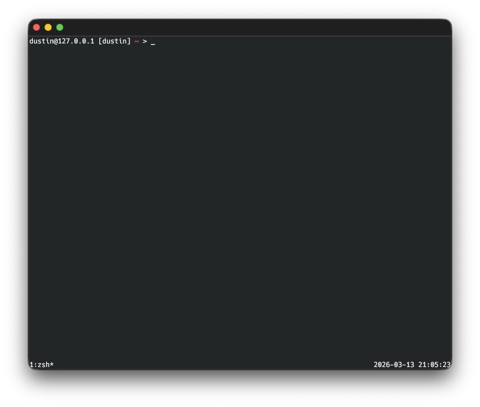

# Conch

A cross-platform terminal emulator with SSH session management, built in Rust with [egui](https://github.com/emilk/egui).

[](https://github.com/an0nn30/rusty_conch/actions/workflows/release.yml)
[](https://github.com/an0nn30/rusty_conch/actions/workflows/release.yml)
[](https://github.com/an0nn30/rusty_conch/actions/workflows/release.yml)
[](https://github.com/an0nn30/rusty_conch/actions/workflows/release.yml)
[](https://github.com/an0nn30/rusty_conch/actions/workflows/release.yml)




## Features

- **Terminal emulation** — Full terminal via [alacritty_terminal](https://github.com/alacritty/alacritty), supporting 256-color, truecolor, mouse reporting, and application cursor mode
- **SSH session management** — Saved connections with proxy jump/command support, organized in folders
- **Tabbed interface** — Multiple local and SSH sessions with Cmd+number switching
- **File browser** — Dual-pane local/remote browser with SFTP upload and download
- **SSH tunnels** — Persistent local port forwarding with activate/deactivate
- **Lua plugin system** — Extend Conch with scripts that have full access to sessions, UI dialogs, crypto, and more ([Plugin docs](docs/plugins.md))
- **Configurable** — Alacritty-compatible config format with Conch-specific extensions for keyboard shortcuts, cursor style, font, colors, and environment variables
- **Native feel** — Optional macOS native menu bar or transparent in-window title bar menu
- **Cross-platform** — macOS (ARM64 + Intel), Windows, Linux (AMD64 + ARM64)

## Installation

### From Release

Download the latest release for your platform from the [Releases](https://github.com/an0nn30/rusty_conch/releases) page:

| Platform | Artifact |
|----------|----------|
| macOS (Apple Silicon) | `Conch-x.x.x-macos-arm64.dmg` |
| macOS (Intel) | `Conch-x.x.x-macos-x86_64.dmg` |
| Windows | `Conch-x.x.x-windows-x86_64.zip` |
| Linux (AMD64) | `.deb` / `.rpm` |
| Linux (ARM64) | `.deb` / `.rpm` |

### From Source

Requires Rust 1.85+ (edition 2024).

```bash
git clone https://github.com/an0nn30/rusty_conch.git
cd rusty_conch
cargo build --release -p conch_app
```

#### Linux Dependencies

```bash
sudo apt-get install -y \
  libxcb-render0-dev libxcb-shape0-dev libxcb-xfixes0-dev \
  libxkbcommon-dev libwayland-dev libgtk-3-dev libssl-dev pkg-config
```

## Configuration

Conch uses an Alacritty-compatible TOML config with additional `[conch.*]` sections.

**Config location:** `~/.config/conch/config.toml` (Linux/macOS) or `%APPDATA%\conch\config.toml` (Windows)

See the [Alacritty config docs](https://alacritty.org/config-alacritty.html) for `[window]`, `[font]`, `[colors]`, and `[terminal]` sections. Conch adds:

```toml
[conch.keyboard]
new_tab = "cmd+t"
close_tab = "cmd+w"
new_connection = "cmd+n"
quit = "cmd+q"
toggle_left_sidebar = "cmd+shift+b"
toggle_right_sidebar = "cmd+shift+e"
focus_quick_connect = "cmd+/"
focus_plugin_search = "cmd+shift+p"

[conch.ui]
native_menu_bar = false    # true = macOS global menu, false = in-window menu
font_size = 13.0
```

## Plugins

Conch has a Lua-based plugin system for automating tasks, building tools, and extending the terminal. Plugins can show dialogs, interact with sessions, encrypt data, and more.

**Quick start:** Drop a `.lua` file in `~/.config/conch/plugins/` and it appears in the Plugins panel.

See the full **[Plugin System Documentation](docs/plugins.md)** for the complete API reference and examples.

## Project Structure

```
crates/
  conch_core/      # Data models, config, color schemes (no framework deps)
  conch_session/   # SSH/local session management, PTY, SFTP, VTE
  conch_plugin/    # Lua plugin runtime and API bindings
  conch_app/       # eframe/egui application, UI, terminal renderer
packaging/
  macos/           # Info.plist for .app bundle
  linux/           # .desktop file
```

## License

MIT
